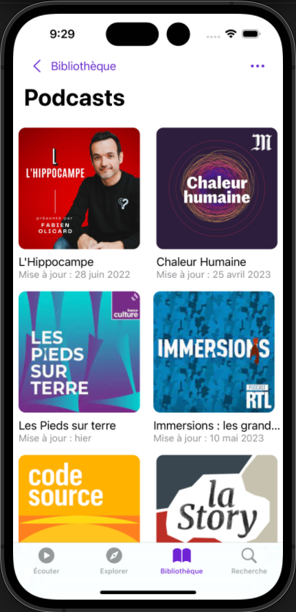
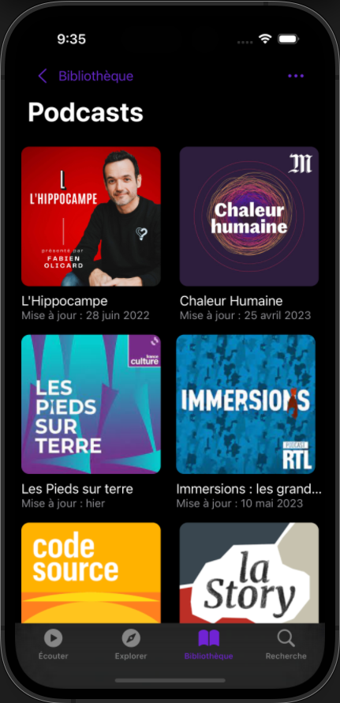
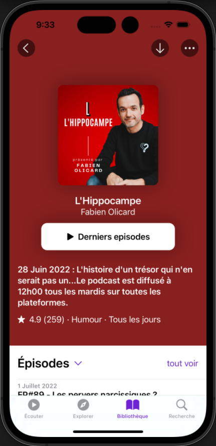
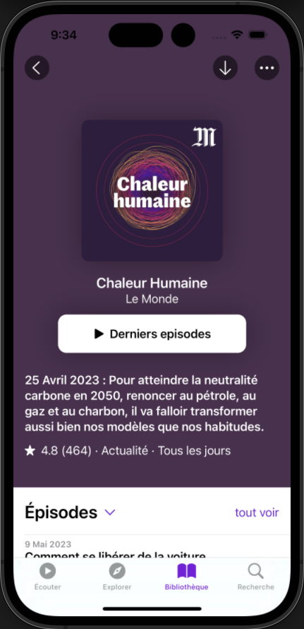
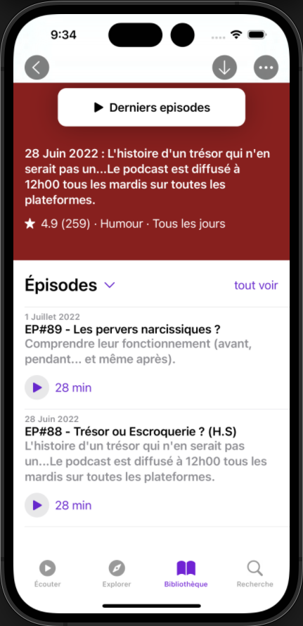
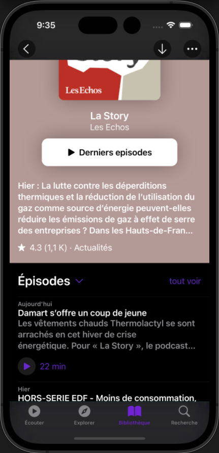

# IOS-Podcast

## Principe

Cette application n'a pas de fonction particulière puisqu'elle constitue uniquement un entrainement aux interfaces swift UI.

Le but de l'exercice était de reproduire 2 pages de l'application officielle Podcast d'Apple et de générer la navigation entre ces dernières.

* utilisation des layouts
* gestion des safe-areas
* calcul de fonds d'écrans à partir de la moyenne des couleurs de l'image du podcast
* Les données proviennent d'un stub

## Visuels

-|-|-
|:---------:|:---------:|:---------:|
Liste des podcasts réalisée en thèmes light et drak|||
Page d'un podcast avec fond de couleur adaptatif|||
Episodes d'un podcast avec les deux thèmes|||